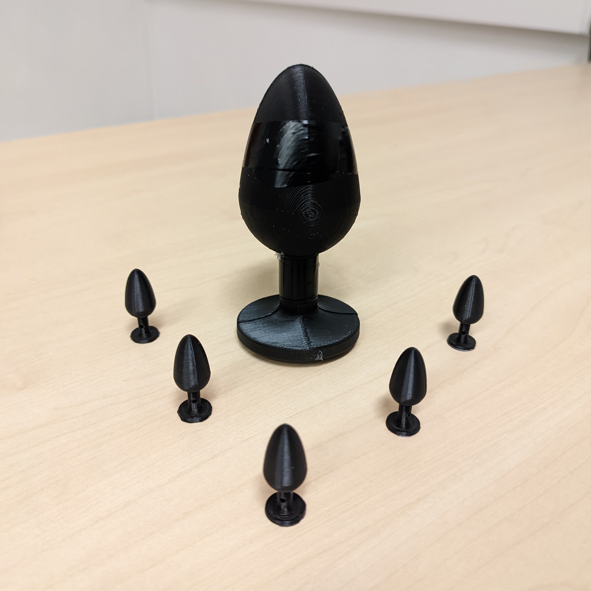
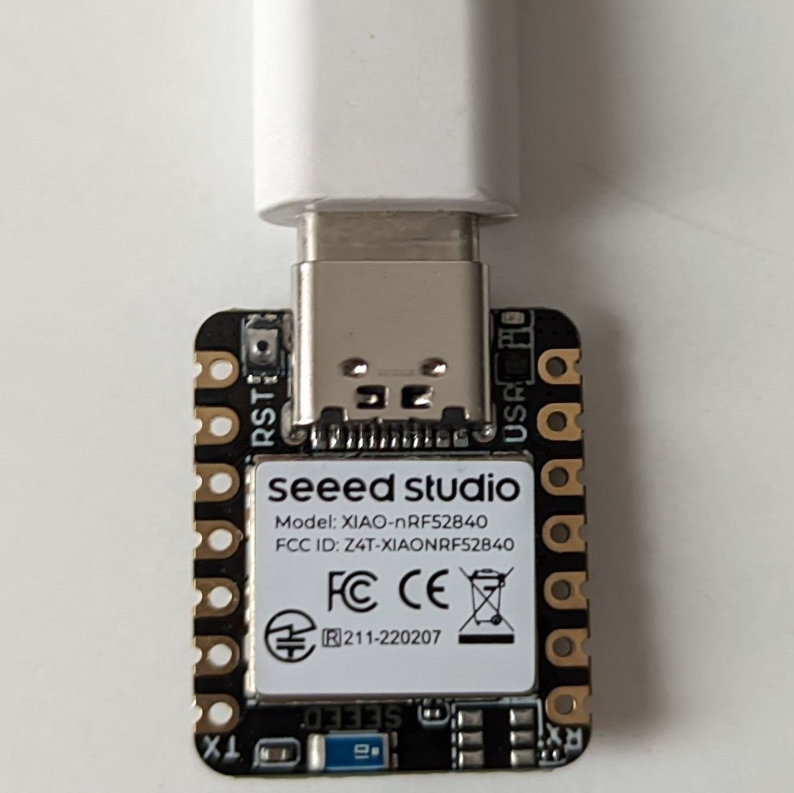

<div align="center">

# AnOV (An Open Vibrator)

A **three-day** DIY project to take a serious approach to a **privacy-first** buttplug full project using [Zephyr RTOS](https://github.com/zephyrproject-rtos/zephyr).

If you care about your phone's privacy, you should care about your intimate privacy too.


</div>

## CAPABILITIES
- **Bluetooth Low Energy** (BLE) communication.
- **Vibration** control.
- **Privacy-first** design.
- **Serotonin** boost.
- **Open-source** hardware and software.
- **Extensible** and **modular** design following open protocols.



## Structure of the project

```bash
.
├── AnOV
├── buttplug-playground
├── intiface-engine
├── models
├── stocklove
├── LICENSE
└── x
```

- **AnOV**: The main project folder, this is the firmware for the Xiao Nrf52840. It uses the Zephyr RTOS to serve a BLE service that activates a PWM signal, to action the motor.

- **buttplug-playground**: A web-frontend that utilizes the OSS [buttplug protocol specification](https://buttplug-spec.docs.buttplug.io/docs/spec).

- **intiface-engine**: The backend of the buttplug.io stack, it has a way of define the **Device protocol**, this, is the way that we communicate with our DIY vibrator, we utilize the protocol T-code (Toy Code), as is simple and powerful.

- **models**: The .stl 3D models of the vibrator. 

- **stocklove**: An alternative buttplug.io-client implementation that interfaces with stockfish to transmit via vibrations the best move in the board (Hans Niemman Technique).

- **LICENSE**: The license of the project, we use the MIT license. This permisive license allows you to use the code in any way you want.

- **x**: A bash script to help with the development of the monorepo.

## How to build this amazing project

### Hardware



### Software


Special thanks to [GPUL](https://gpul.org/) for the amazing event. 
